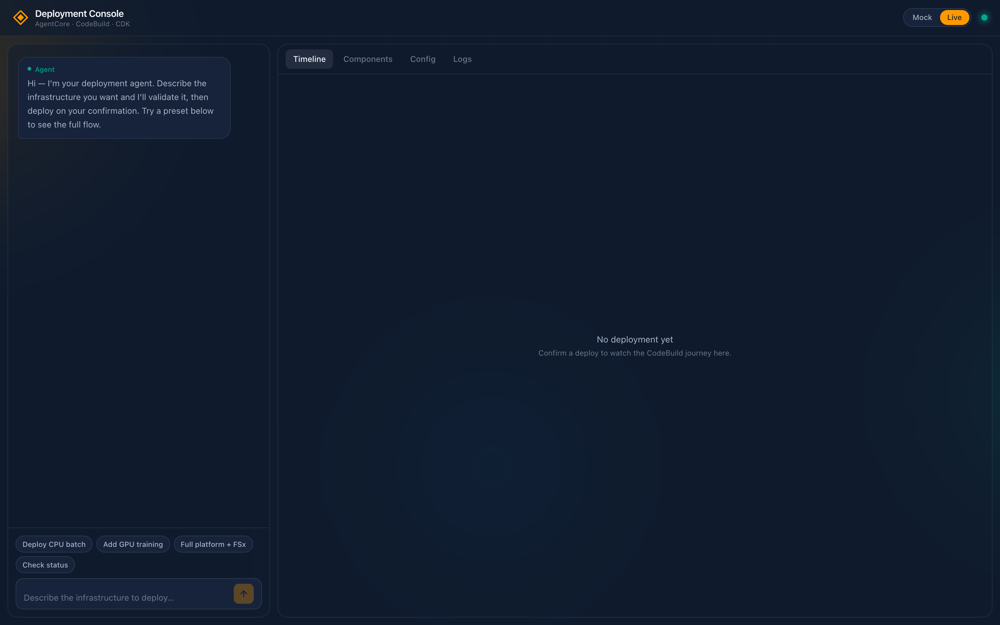
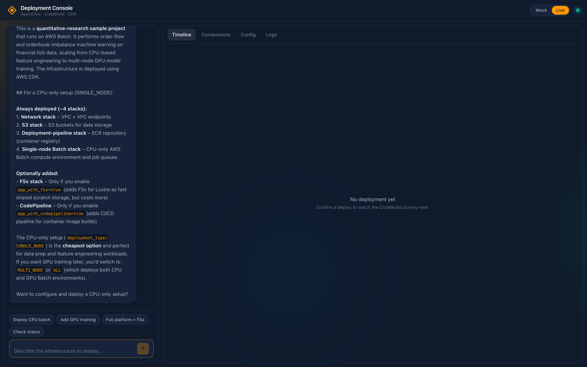
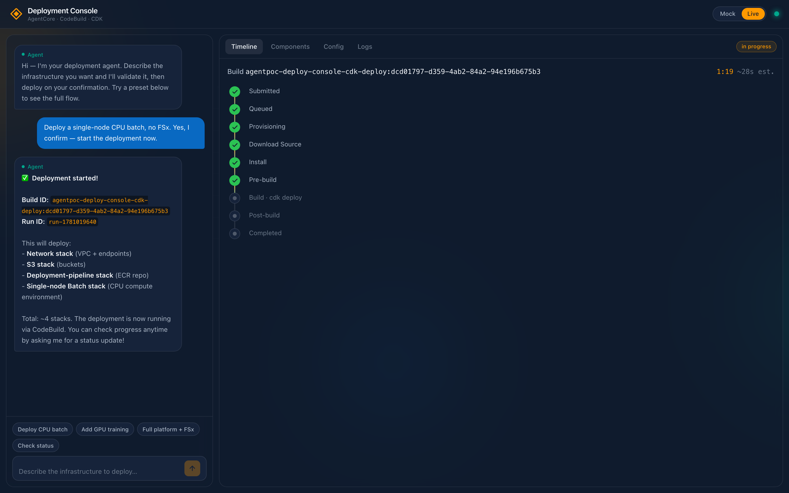
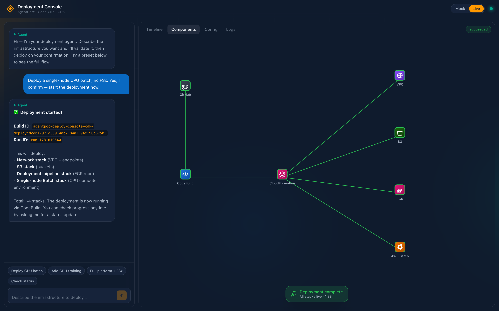

# Deployment Console

An agent-driven, chat-based UI for configuring and deploying the quant-research AWS Batch
solution in this repository. A user describes their goal in natural language; a Bedrock
AgentCore agent builds a **validated configuration**, the user reviews and approves it via
an inline options form, and the platform deploys the existing `infrastructure/` CDK app
through CodeBuild — streaming build status, logs, deployed stacks, and resources back to a
live canvas.

> **Status:** Working proof of concept. One command (`./deploy-console.sh`) stands up the
> entire console; see **[DEPLOY.md](./DEPLOY.md)** for the full deploy guide.

> ⚠️ **POC posture — read before deploying.** This console has **no authentication** on the
> app or its backend, and the deploy path uses an `AdministratorAccess` CodeBuild role. That
> is acceptable **only** for a single-operator sandbox/burner account. **Add auth, an
> approval gate, and a scoped deploy role before any shared or production use.**

## How it works

```
┌────────────┐   HTTPS   ┌──────────────┐   invoke   ┌──────────────────────┐
│  Browser   │ ───────▶  │ Lambda bridge│ ─────────▶ │ Bedrock AgentCore    │
│  (React    │  /api/*   │ (Function URL│            │ runtime (the agent)  │
│   SPA)     │ ◀───────  │  behind CF)  │ ◀───────── │  + tool calls        │
└────────────┘           └──────────────┘            └──────────┬───────────┘
      ▲                          │                              │ start_deployment
      │ static (S3+CloudFront)   │ CodeBuild / CFN / Logs reads │ get_status / get_logs
      │                          ▼                              ▼
      │                   ┌─────────────────────────────────────────────┐
      └────────────────── │ CodeBuild → clones the infra repo → `cdk     │
                          │ deploy` of infrastructure/ (the quant Batch  │
                          │ solution) into the target account            │
                          └─────────────────────────────────────────────┘
```

- **Frontend** — React + Vite SPA (chat + live status canvas), served from S3 via
  CloudFront with Origin Access Control. Credentials never touch the browser.
- **Bridge** — a single Lambda (behind a CloudFront `/api/*` behavior) that keeps AWS
  credentials server-side and exposes read/act endpoints: invoke the agent, and read
  CodeBuild builds, CloudFormation stacks, and CloudWatch logs.
- **Agent** — a Bedrock AgentCore runtime. It only ever produces a `parameters` override
  that passes `schema/config.schema.json`, then calls tools to start and observe a
  deployment. It never authors or runs code.
- **Deploy path** — CodeBuild clones the infrastructure repository and runs its CDK app.
  Observability is **pull-based**: the agent/bridge read `codebuild:BatchGetBuilds` and
  `logs:GetLogEvents` directly (no push relay).

## Screenshots

**1. Open the console** — a chat pane on the left, a live deployment canvas on the right,
and a Mock/Live toggle. Preset chips offer quick starts (Deploy CPU batch, Add GPU training,
Full platform + FSx, Check status).



**2. Ask the agent to explain the solution** — describe your goal in plain language and the
agent explains the quant-research pipeline: which stacks always deploy, which are optional
(FSx, CodePipeline), and how the deployment types (`SINGLE_NODE` / `MULTI_NODE` / `ALL`) map
to cost and workload.



**3. Watch the deployment live** — confirming a deploy calls `start_deployment`, which kicks
off the real CodeBuild run. The timeline streams each phase (Submitted → Queued →
Provisioning → Download Source → Install → Pre-build → Build · cdk deploy → … → Completed).



**4. See what's deployed** — when the build finishes, the Components canvas shows the live
architecture graph (GitHub → CodeBuild → CloudFormation → VPC / S3 / ECR / AWS Batch) with a
**Deployment complete — all stacks live** banner.



## Quickstart

```bash
cd deployment-console
AWS_PROFILE=<your-sandbox-profile> ./deploy-console.sh
```

A clean run takes ~7 minutes and prints the Console URL plus every resource id. See
**[DEPLOY.md](./DEPLOY.md)** for prerequisites, configuration env vars, verification steps,
idempotency behavior, troubleshooting, and teardown.

## Repository layout

| Path | What |
|---|---|
| `deploy-console.sh` | Single idempotent entry point — provisions/updates everything in order |
| `frontend/` | React + Vite SPA — chat + live status/canvas |
| `agent/` | AgentCore agent: `main.py`, system prompt/config, `build_package.sh` (arm64 zip), `deploy_agent.py` (create-or-update runtime), config validation |
| `backend/tools/` | Agent tools — `start_deployment.py`, `get_status.py` (get_logs shares the bridge) |
| `backend/orchestration/` | `merge_params.py` + `buildspec.yml` (the CodeBuild deploy recipe) |
| `platform-infra/` | CDK for the console platform: artifact S3 bucket + CodeBuild project |
| `hosting/` | CDK for hosting: SPA S3 bucket + CloudFront (OAC) + Lambda bridge |
| `schema/` | `config.schema.json` + `validate.py` — the deployment-config contract |
| `docs/images/` | Console screenshots used in this README |

## Core design decisions

1. **Internal tool, single account** — one CDK deploy role; no cross-account vending.
2. **Bedrock AgentCore (GA)** hosts the agent — SSE streaming, tool calls.
3. **Config is the contract** — the agent only ever emits a `parameters` override that
   passes `schema/config.schema.json`; it never authors or runs code.
4. **No auth in the POC** — single trusted operator, sandbox only (see posture note above).
5. **Infra source = the public repo**, cloned by CodeBuild at deploy time; the repo URL/branch
   are configurable (`SOURCE_OWNER`/`SOURCE_REPO`/`SOURCE_BRANCH`).
6. **Pull-based observability** — the agent reads `codebuild:BatchGetBuilds` +
   `logs:GetLogEvents` directly. No AppSync/EventBridge/Live-Tail relay.
7. **Teardown and cost estimation are out of scope** for this pass.

## Runtime artifacts are not code

Per-deployment outputs — the parameter override, build IDs, CDK outputs — are **data**
(S3 + CodeBuild build records), never committed to this repo. The CodeBuild build id is the
source of truth for a given run.

> **Keep account-specific values out of committed source.** Account IDs, distribution ids,
> ARNs, profile names, and other environment specifics belong in env/config, never in code
> or docs. Build artifacts (`cdk.out/`, `node_modules/`, `.venv/`, `dist/`) are gitignored.

## License

Licensed under the MIT-0 License. See the repository root [`LICENSE`](../LICENSE).
